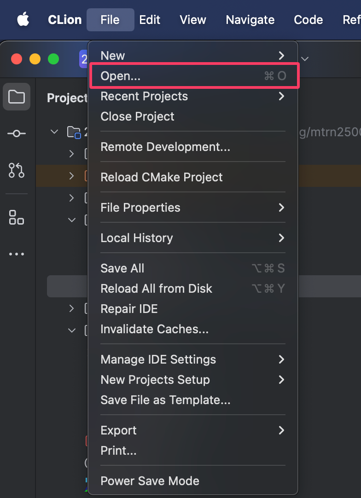
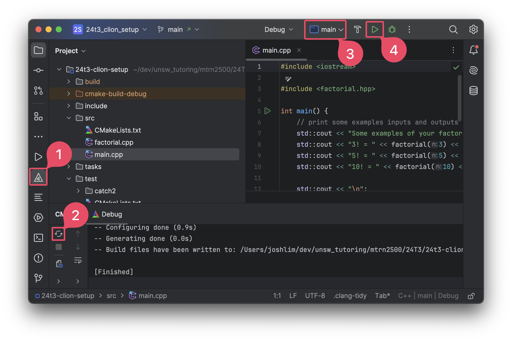
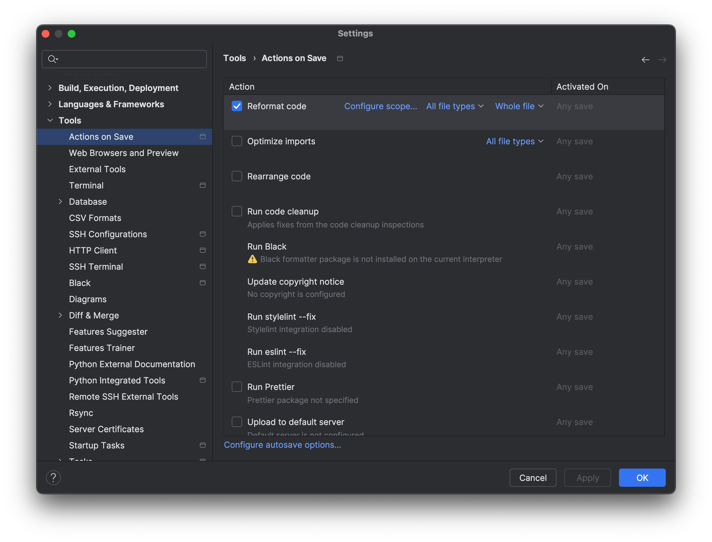

# MTRN2500 24T3 CLion Setup Lab Task

1. Download and install CLion

2. Clone this repository to your computer (or download it as a `.zip` file and extract it)

3. Open CLion and open the repository folder

4. Explore the project structure. You should see a `main.cpp` file in the `src/` directory and some unit tests written in `UnitTest.cpp` in the `tests/` directory. You can also see a header file `factorial.hpp` in the `include/` directory and its corresponding implementation file `factorial.cpp` in the `src/` directory.

5. You can run the project by clicking the green play button in the top right corner **(4)**. If the `main` configuration is selected in the dropdown menu **(3)**, it will run the `main.cpp` file. If the `test` configuration is selected, it will run the unit tests.
   _You may need to configure the CMake settings for the project. You can do this by clicking on the CMake button in the left sidebar (1) and then clicking the reload button (2) to reload the CMake project._

6. Fix the incorrect unit test in `tests/UnitTest.cpp`.

7. Implement the `factorial` function in `src/factorial.cpp`

8. Run the unit tests to check if your implementation is correct. All tests should now pass.

## Optional Tasks

### Enable format-on-save

The `.clang-format` file in the root directory of the project contains the formatting settings for the project. You can enable format on save in CLion in the settings, by going to `Tools -> Actions on Save -> Reformat code`.

